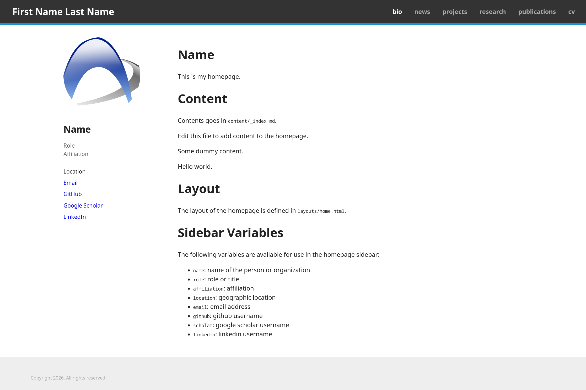

# (Arch) Wiki-like Hugo Theme



## Usage

1. Install Hugo following the [official instructions](https://gohugo.io/installation/).

2. Initialize a new Hugo site:

   ```
   hugo new project mywebsite
   cd mywebsite
   ```

3. Add the theme as a Git submodule:

   ```
   git init
   git submodule add https://github.com/27Co/hugo-wiki-theme.git themes/hugo-wiki-theme
   ```

4. Copy example site and use the theme:

   ```
   cp -r themes/hugo-wiki-theme/example/* .
   echo 'theme = "hugo-wiki-theme"' >> hugo.toml
   ```

5. Modify the content in the `content` directory as needed.
